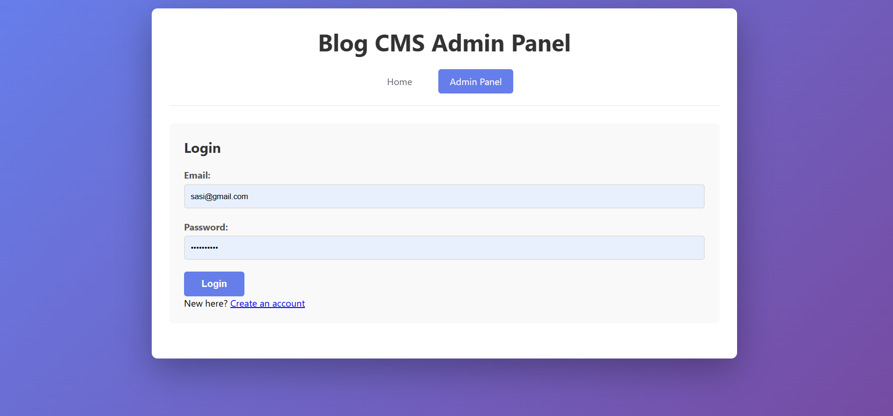
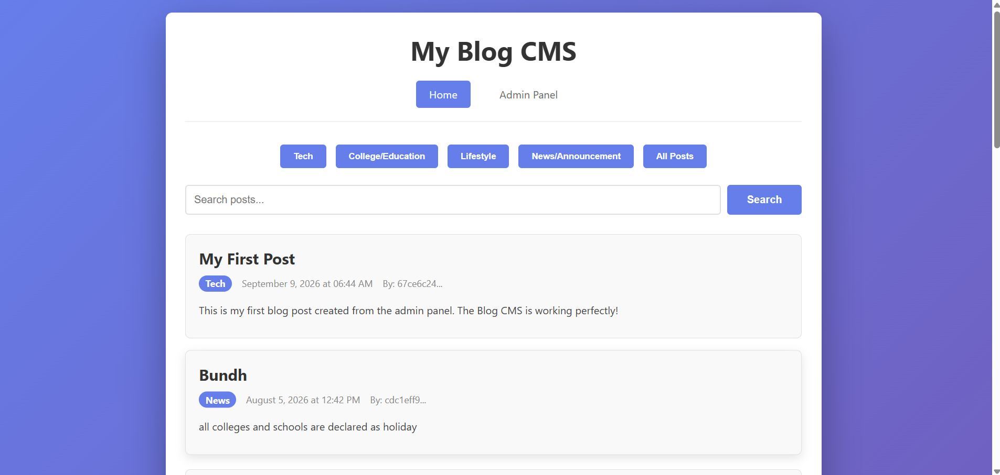
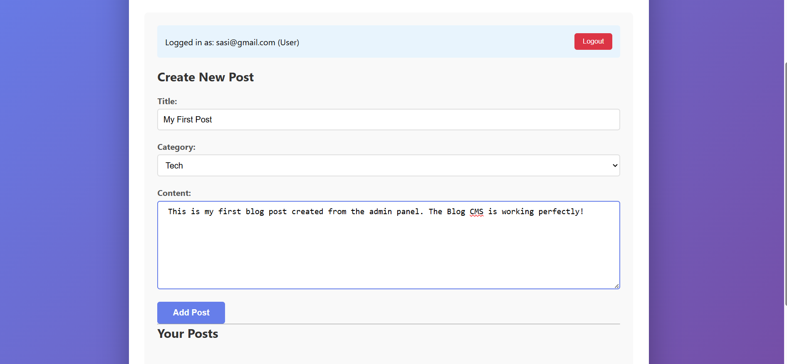
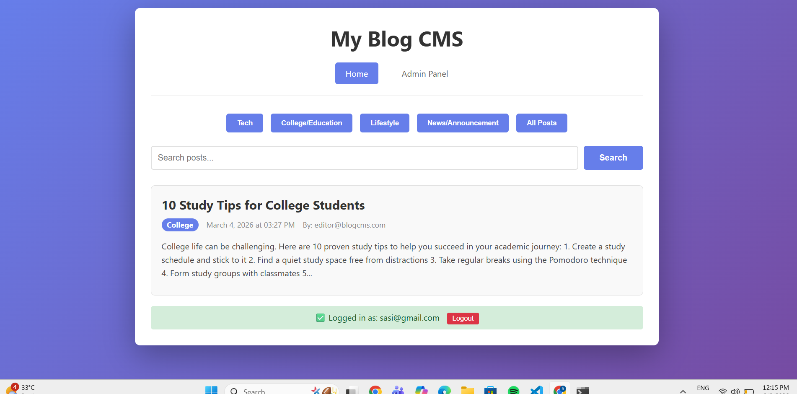

## 📌 Blog CMS - Content Management System

**Blog CMS** is a full-stack web application that enables users to create, manage, and organize blog posts efficiently. It provides a secure platform with role-based access control, allowing different user roles (Admin, Editor, User) to perform specific actions. The system features a clean, responsive interface with category filtering and search functionality.

---

## ✨ Features

### 🔐 Authentication
- JWT-based user registration and login
- Role-based access control (Admin, Editor, User)
- Secure session management
- Password hashing using ASP.NET Core Identity
- Token refresh mechanism

### 📝 Blog Management
- Create, Read, Update, Delete (CRUD) blog posts
- Category filtering (Tech, College, Lifestyle, News)
- Search posts by title or content
- Responsive post cards with metadata display
- Real-time post updates

### 👥 Role-Based Access
| Role | Create | Edit | Delete |
|------|--------|------|--------|
| **Admin** | ✅ Yes | ✅ Yes (All) | ✅ Yes (All) |
| **Editor** | ✅ Yes | ✅ Yes (Own) | ❌ No |
| **User** | ✅ Yes | ✅ Yes (Own) | ❌ No |

### 🎨 User Interface
- Clean, responsive design
- Category filter buttons
- Search bar for quick post discovery
- Admin panel for post management
- Post cards with category badges
- Timestamp display for posts
- Author information

### 🛡️ Security Features
- JWT authentication
- Token validation
- Input validation
- CORS configuration
- Password hashing
- Role-based authorization

---

## 🛠️ Tech Stack

### ⚙️ Backend
| Technology | Purpose |
|------------|---------|
| .NET 10.0 | Core Framework |
| ASP.NET Core Web API | REST API Framework |
| Entity Framework Core 9.0 | ORM |
| SQLite | Database |
| JWT | Authentication |
| ASP.NET Core Identity | User Management |
| Swagger/OpenAPI | API Documentation |
| Serilog | Logging |
| In-Memory Cache | Performance Optimization |

### 🖥️ Frontend
| Technology | Purpose |
|------------|---------|
| HTML5 | Structure |
| CSS3 | Styling |
| JavaScript (ES6) | Functionality |
| Google Fonts | Typography |

---

## 📸 Screenshots

### 🔐 Login Page

*Secure login page with JWT authentication*

### 🏠 Homepage

*Blog homepage displaying all posts with category filters and search bar*

### 📄 Post Page

*Detailed post view with full content and author information*

### 📝 Blog Posts

*Post cards showing title, category, content preview, author, and timestamp*

---

## 📁 Project Structure

```
blog-cms/
│
├── backend/
│   └── BlogCMS.API/
│       ├── Controllers/
│       │   ├── AuthController.cs
│       │   └── PostsController.cs
│       │
│       ├── Models/
│       │   ├── Post.cs
│       │   └── ApplicationUser.cs
│       │
│       ├── Data/
│       │   ├── ApplicationDbContext.cs
│       │   └── DbInitializer.cs
│       │
│       ├── DTOs/
│       │   ├── PostDTOs.cs
│       │   └── AuthDTOs.cs
│       │
│       ├── Services/
│       │   ├── PostService.cs
│       │   └── AuthService.cs
│       │
│       ├── Repositories/
│       │   ├── IPostRepository.cs
│       │   └── PostRepository.cs
│       │
│       ├── Middleware/
│       │   └── ExceptionHandlingMiddleware.cs
│       │
│       └── Program.cs
│
├── frontend/
│   ├── index.html          # Homepage
│   ├── admin.html          # Admin Panel
│   ├── script.js           # Homepage JavaScript
│   ├── admin.js            # Admin Panel JavaScript
│   └── style.css           # Styling
│
├── screenshots/
│   ├── home.png
│   ├── blogs.png
│   ├── login.png
│   └── postpage.png
│
├── README.md
└── .gitignore
```

---

## 🚀 Getting Started

### 📋 Prerequisites
- .NET 10.0 SDK
- SQLite (included)
- Git

### ⚙️ Installation

#### 1️⃣ Clone Repository
```bash
git clone https://github.com/renuka-11/blog-cms.git
cd blog-cms
```

#### 2️⃣ Backend Setup
```bash
cd backend/BlogCMS.API
dotnet restore
dotnet build
dotnet ef database update
dotnet run
```

Backend runs at:
```
http://localhost:5000
```

#### 3️⃣ Frontend Setup
```bash
cd frontend
# Open index.html in browser (double-click)
# OR use Live Server extension in VS Code
```

Frontend runs at:
```
http://localhost:5500 (Live Server)
```

---

## 🔑 Configuration

### Update `appsettings.json`:
```json
{
  "ConnectionStrings": {
    "DefaultConnection": "Data Source=blogcms.db"
  },
  "Jwt": {
    "Key": "YourSuperSecretKeyForJWTTokenGenerationAtLeast32CharsLong",
    "Issuer": "BlogCMS",
    "Audience": "BlogCMSClient"
  }
}
```

---

## 📡 API Endpoints

### 🔐 Authentication
| Method | Endpoint | Description |
|--------|----------|-------------|
| POST | `/api/v1/Auth/register` | Register new user |
| POST | `/api/v1/Auth/login` | Login |
| POST | `/api/v1/Auth/refresh-token` | Refresh JWT token |
| POST | `/api/v1/Auth/logout` | Logout |

### 📝 Posts
| Method | Endpoint | Description |
|--------|----------|-------------|
| GET | `/api/v1/Posts` | Get all posts |
| GET | `/api/v1/Posts/{id}` | Get post by ID |
| GET | `/api/v1/Posts/search?q={term}` | Search posts |
| GET | `/api/v1/Posts?category={cat}` | Filter by category |
| POST | `/api/v1/Posts` | Create new post |
| PUT | `/api/v1/Posts/{id}` | Update post |
| DELETE | `/api/v1/Posts/{id}` | Delete post |

---

## 👥 Sample Users

| Role | Email | Password |
|------|-------|----------|
| **Admin** | admin@blogcms.com | Admin@123456 |
| **Editor** | editor@blogcms.com | Editor@123456 |
| **User** | chikkam@gmail.com | Test@123456 |

---

## 📊 Sample API Response

### GET /api/v1/Posts Response
```json
[
  {
    "id": 1,
    "title": "Getting Started with ASP.NET Core",
    "category": "Tech",
    "content": "ASP.NET Core is a cross-platform framework...",
    "createdAt": "2026-03-02T15:27:42.1633981",
    "updatedAt": null,
    "createdBy": "admin@blogcms.com"
  }
]
```

### POST /api/v1/Auth/login Request/Response
**Request:**
```json
{
  "email": "admin@blogcms.com",
  "password": "Admin@123456"
}
```

**Response:**
```json
{
  "token": "eyJhbGciOiJIUzI1NiIs...",
  "refreshToken": "pzUboMUram8Ogv6Cj9m...",
  "expiration": "2026-08-05T11:37:48.1084248Z",
  "email": "admin@blogcms.com",
  "fullName": "System Administrator",
  "roles": ["Admin"]
}
```

---

## 🔮 Future Enhancements

- Deploy to cloud (Azure/AWS)
- Rich text editor for posts
- Image upload support
- Comments system
- Post likes and shares
- Email notifications
- User profiles
- Post scheduling
- Analytics dashboard
- Docker containerization

---

## 🙏 Acknowledgments

- .NET Core Team
- Entity Framework Core Team
- Open-Source Community

---

## 👨‍💻 Author

**Chikkam Renuka**
- Email: chikkamrenukachikkam@gmail.com
- GitHub: [https://github.com/renuka-11](https://github.com/renuka-11)
- LinkedIn: [Renuka Chikkam](https://www.linkedin.com/in/renuka-chikkam-3b2315342/)

---

## 📄 License

This project is licensed under the MIT License.

---
